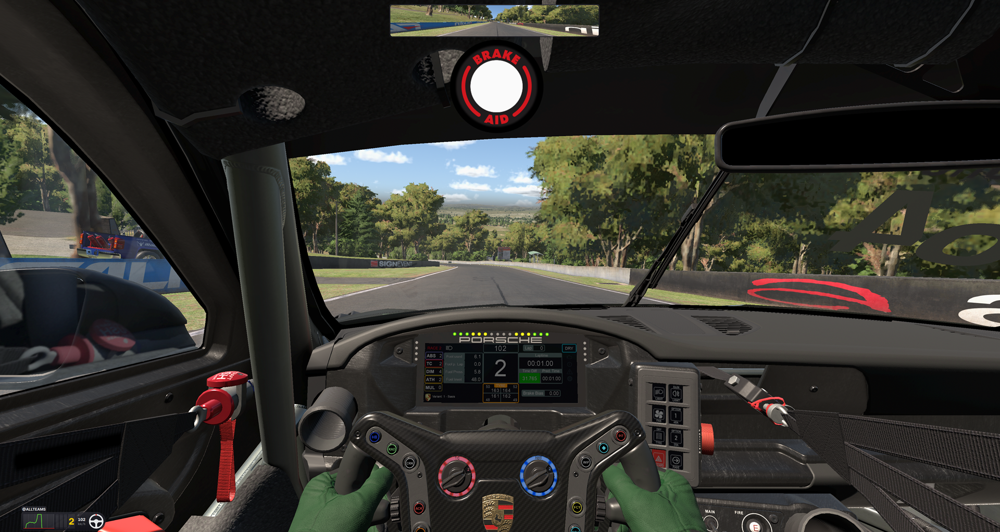

# Brake Aid Sim Edition
### Real-Time Sim Racing Companion App 

 "In racing there are always things you can learn, every single day. There is always space for improvement, and I think that applies to everything in life." - Lewis Hamilton 

### Do you know when to brake? Do you brake too early or too late? And most importantly, do you brake consistently? 

### Knowing When To Brake
Braking is one of the most critical elements of race driving, directly influencing lap time, consistency, and overall vehicle control. Knowing when to brake—and doing so consistently — is what separates confident, fast drivers from the rest. 
Brake too late, and you risk overshooting the corner; too early, and you sacrifice speed. 
Having a reliable braking point near the limit is a major advantage. It allows you to charge down a straight with confidence, spot your marker, and commit fully — knowing the car will slow exactly as needed to make the corner quickly and cleanly. 
That confidence and certainty are what unlock a driver’s true potential and ultimately make winning possible. 
At that point, driving becomes a matter of precision: simply hitting your marks, lap after lap. Small, clear adjustments — like braking two metres earlier — become easy to understand and execute, making performance gains both measurable and repeatable.

### Unique Features
Brake Aid delivers a real-time “BRAKE NOW” overlay by analysing your driving data through its adaptive algorithm. 
It continuously learns from your inputs—tracking where you apply the brakes, your reaction time, rate of deceleration, and minimum corner speed for every corner, lap after lap. 
To refine your braking points, you can adjust your marker in precise 2-metre increments using configurable button inputs, helping you find the optimal limit. Once locked in, Brake Aid dynamically updates your braking markers in real time based on your approach speed. 
As your exit and entry speeds improve, the system moves your marker further back to maintain optimal corner performance. If conditions change — such as missed shifts or traffic — it automatically brings the marker forward. 
All performance data is logged, including brake markers, driver inputs, car, and track details -- just dial in your brake markers once, and they’re ready every time you return — tailored to each car and track, with sharing support.

### Overview
- Analyses the players own driving performance to calculate dynamic brake markers for each corner of any race circuit.
- Dynamic brake markers are communicated to the player using an on-screen *anticipation light* graphic that illuminates one second before the brake marker is reached, and turns off once the vehicle is at the brake marker, signalling the player to brake.
- Dynamic brake makers are speed and reaction time compensated, to ensure consistent mid-corner and exit speeds, regardless of the vehicle's approach speed.
- Brake markers are fine tuneable in two metre increments, via two user-assignable control inputs, to dial in braking performance for each corner of the race circuit.
- Brake markers are iterative by default and are updated based on the braking performance of the previous lap.
- *Don’t count lap* function allows the user to disregard the current lap being driven from updating the brake markers.
- *Restricted mode* allows the user to freeze the current set of brake markers, so that they don’t update/iterate lap to lap.
- Brake markers from a previous race session for a car and track combination can be reloaded in new sessions.
- Multi-user support.

## Supported Games
- iRacing
- Assetto Corsa

### Third-Party Notice
Brake Aid Sim Edition is an independent third-party add-on. 
All game titles, trademarks, and related marks are the property of their respective owners. 
Brake Aid Sim Edition is not affiliated with, endorsed by, or sponsored by any supported game developer or publisher unless explicitly stated.

## System Requirements
- Operating System: Windows 10 or Windows 11 (64-bit)
- Supported sim racing game installed on the same PC (see list above)
- Hardware: PC must meet the minimum system requirements for the supported sim racing game you intend to use
- Runtime Dependencies: All required application runtime files are included with this release (no separate Visual C++ installation normally required)
- .NET Framework: Microsoft .NET Framework 4.8 or later (included by default on most Windows 10/11 systems)
- Storage: At least 20MB free space for this add-on.
- Permissions: Administrator privileges may be required for initial setup or certain hardware / integration features

#### Notes:
- This software is an add-on and requires a compatible supported sim racing game to function.
- Performance is primarily dependent on the host game’s system requirements rather than this add-on itself
- Windows 10/11 Home and Pro are supported; other editions may work but have not been officially tested
- For best compatibility, keep Windows and supported game installations up to date

## Quick Start
1. Download the latest release from the Releases page  
2. Extract the ZIP to a desired folder on your PC
3. Run Brake Aid Beta.exe  
4. On the setup interface, click *Button Mapping* in the left pane and map Brake Aid's functions to either keyboard keys or physical buttons on your sim hardware.
5. Click *Brake Aid Setup* on the left pane, create a new user, then click *NEXT* on the bottom right.
8. Launch a supported sim racing game
9. Start a race session (which will prompt the Brake Aid interface to reappear)
10. Within the Brake Aid setup interface, click *Start New Session* (the interface will minimise to the system tray)
11. Head out onto the race track and complete a *benchmark lap* which Brake Aid will analyse in the background.
12. From the second lap onwards, Brake Aid will display dynamic brake markers for each of the corners using the on-screen *anticipation light* graphic, which will **illuminate amber** 1 second before reaching the corner's dynamic brake marker, then **turn off** at the **instant** that the marker point is reached.  

### Windows Defender SmartScreen Notice

Because Brake Aid is currently distributed as an unsigned public beta application, Windows Defender SmartScreen may display a warning when launching the software for the first time.

This is expected behavior for newly distributed applications that have not yet established Windows reputation/signing trust.

#### If Windows Displays “Windows protected your PC”
- Click **More info**
- Click **Run anyway**

You may need to do this **once** on first launch for both:

Brake Aid Beta.exe 
BrakeAidCore.exe (see below) 

#### If the Brake Aid UI Interface Opens But The Software Does Not Function Correctly

Windows may have blocked Brake Aid's backend component (BrakeAidCore.exe) from starting. 
(You can verify whether the backend component is running by checking whether the Brake Aid icon is present in the Windows system tray.)

To resolve:
1. Close the Brake Aid UI Window (if open)
2. Open the Brake Aid root folder (the extracted ZIP)
3. Navigate to the **Core Files** directory
4. Manually launch **BrakeAidCore.exe**
5. If prompted by Windows SmartScreen:
- Click **More info**
- Click **Run anyway**  
The backend may immediately close after manual launch — this is normal
6. Launch **Brake Aid Beta.exe** again normally — Brake Aid should now launch with full functionality.
  

## Beta Access / License Token

Brake Aid is currently free to use during beta.

Each release includes a time-limited beta license token that enables full functionality until its expiry date (shown in the **ABOUT** tab of the setup interface). 
Once a token expires, the software will no longer function until an updated public beta token is downloaded from this repository. 
Updated beta tokens will be made available through this repository.

### Updating the license token
- Download the latest license token (BALicense.lic) from [here](https://raw.githubusercontent.com/BrakeAid/sim/main/beta-license-token/BALicense.lic)
- Ensure the Brake Aid application is fully closed (check the system tray!)
- Navigate to the *Brake Aid License* sub directory within the Brake Aid root folder.
- Copy/move the updated license token file, *BALicense.lic* into this directory (overwrite the existing license token file, if present)
- Launch the Brake Aid application again and check the **ABOUT** tab to confirm the license token has been successfully applied.

## Full User Guide

For detailed setup, feature explanations and troubleshooting, see the full *Brake Aid User Guide* PDF available [here](docs/Brake%20Aid%20User%20Guide.pdf)

## Support, Feedback & Beta Community

Join the official Brake Aid Discord community for beta support, troubleshooting, compatibility discussion, bug reporting, and feature requests.

### Join the Discord
[Official Brake Aid Beta Discord](https://discord.gg/ESt7pu5yyD)

### Discord Channels Include:
- General Discussion
- Bug Reporting
- Feature suggestions and general feedback
- Troubleshooting

## Legal / Terms

### Beta Status
This software is currently distributed as a beta release and may contain bugs, incomplete features, or changes between versions.

### Usage
This beta software is currently provided free of charge for evaluation and testing purposes.

### Redistribution
You may not redistribute, mirror, or repackage this software or its associated license tokens without permission.

### Proprietary Software
This software is proprietary and closed-source. Unauthorized modification or reverse engineering is prohibited.

### No Warranty
This software is provided "as is" without warranty of any kind. Use at your own risk.  

© 2026 Vertech Hume International Pty Ltd. All rights reserved.

